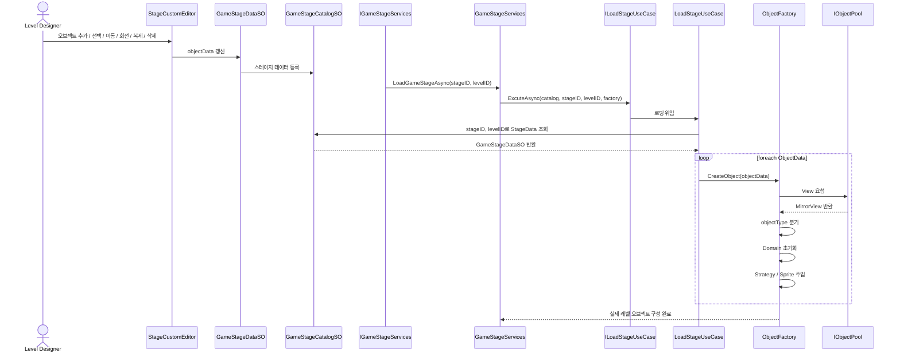
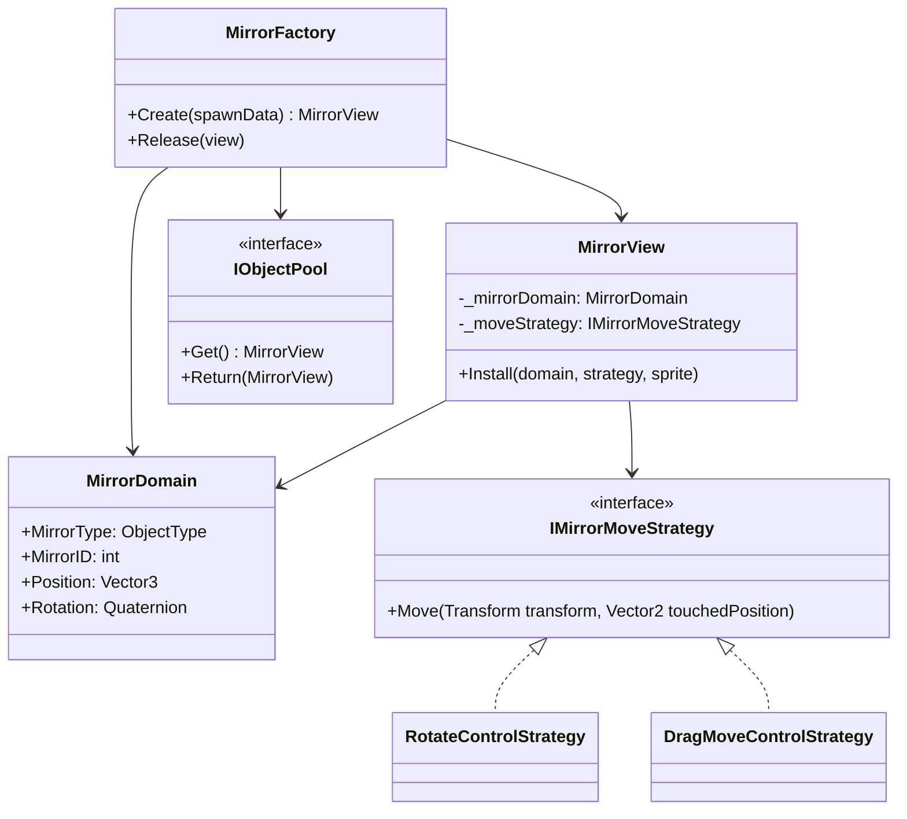

# Polar-Less
> 본 프로젝트는 2026학년도 1학기 광운대학교 게임종합동아리에서 진행한 프로젝트 게임으로, 빛의 입사/반사를 이용해 빛을 목표 지점까지 도달시키는 퍼즐 게임입니다. 

## Links
- [[기획/기술 문서 & 아트 에셋 Google Drive]]("https://drive.google.com/drive/folders/19KnFjmr55tBnQA4sDTWhPLQbADn3SrpX")
- [[개발 일정표]]("https://docs.google.com/spreadsheets/d/13U3A6tnWeJETY449GSzQN1v2WFgqNV6fHpt-UPKcKvY/edit?gid=1651898734#gid=1651898734")

## Project Info
- **게임**: Polar-Less
- **장르**: 2D 횡스크롤 퍼즐 스토리 어드벤처
- **플랫폼**: Android, IOS(예정)
- **엔진**: Unity 6 LTS (6000.2.12.f1)(URP)
- **개발 기간**: 2026.03 ~ 2026.08(예정)
- **개발 도구**: C#
- **버전 관리**: Git, GitHub
- **아키텍쳐 패턴**: 도메인 주도 설계 기반
- **개발 인원**: 8인

## 구현상세
#### 1. **협업용 기능 구현** [[상세내용.md]](""): 
1)레벨 디자인용 커스텀 에디터 제작: 기획자가 유니티 에디터(인스펙터)상에서 프로그래밍적 지식 없이도 레벨 디자인이 가능하도록 유니티의 커스텀 에디터 기반의 레벨 배치 툴을 구현하였습니다. 기획자는 커스텀 에디터를 통해 실제 프리뷰 오브젝트를 씬에 표시한 상태에서 위치와 회전을 시각적으로 조정하고, 이를 스크립터블 오브젝트로 저장할 수 있습니다. 런타임에서는 이렇게 제작된 스크립터블 오브젝트를 통해 선택된 레벨의 구성을 동적으로 가져올 수 있습니다.

2)(예정)대화 데이터 테이블 파싱: 기획자가 제작한 데이터 테이블(스프레드 시트)을 유니티의 스크립터블 오브젝트로 변환하여 유니티 내에서 에셋으로 관리할 수 있도록 구현하였습니다.
#### 2. **오브젝트 구현** [[상세내용.md]](""): 본 시스템은 레이저 반사 퍼즐의 핵심 오브젝트이자 반복적으로 사용하게 되는 거울 오브젝트를 단순 기능 구현을 넘어 확장성, 재사용성, 입력 안정성, 생성 비용 관리를 중심으로 설계했습니다.
1)오브젝트의 구조 설계: 다양한 종류의 거울을 구현하기 위해, 각 오브젝트를 행동과 데이터의 조합에 따라 분류하여 거울 시스템을 View, Domain, Strategy, Factory, Pool로 분리하여 각 계층이 단일 책임만 가지도록 설계했습니다.
- MirrorView : Unity 오브젝트, 입력 및 시각 표현 담당
- MirrorDomain : 오브젝트 타입, 위치, 각도, ID로 구성된 런타임 데이터
- IMirrorMoveStrategy: 오브젝트의 조작 로직
- MirrorFactory : 거울 생성 및 초기화 담당
- MirrorPool : View 재사용 관리

2)전략 패턴 기반 조작 로직 분리: 거울의 차이를 행동 방식으로 정의하고, 조작 로직을 전략 패턴으로 분리하여, 각 view가 로직을 하나의 인터페이스를 통해서 참조하여 입력과 로직을 분리했습니다. 이러한 구조는 전략을 하나의 공유 인스턴스로 재사용하여 새로운 오브젝트를 생성할 때 힙 메모리 할당을 줄이며, 기존 코드의 수정없이 새로운 행동 방식의 오브젝트를 추가할 수 있습니다.
- 회전거울: RotateMirrorMoveStrategy
- 수평이동 거울: SlideMirrorMoveStrategy

3)팩토리 패턴을 통한 생성 책임 집중: 오브젝트의 생성 및 조립, 초기화를 하나의 계층으로 집중시켜 생성 경로 단일화하여 초기화 누락을 방지하고, 한 번의 호출로 완전히 초기화된 오브젝트를 보장하였습니다.
- 타입별 오브젝트 풀 선택
- Domain 초기화
- 전략 생성 및 주입

4)오브젝트 풀링: 거울은 레벨 생성 과정에서 반복적으로 재배치/재생성되는 대상이기 때문에 오브젝트 풀링을 적용하여 Instantiate/Destroy 호출로 인한 GC 할당을 줄여 프레임 드랍을 방지하였습니다. 이 과정에서 View(MonoBehavior)와 Strategy 구현체만 재사용하고 도메인은 생성 시점마다 초기화하여 상태 누수를 방지하였습니다.


## 기술적 포인트 & 문제해결
<!--문제 원인->해결방안->개념학습 순으로 정리(구체적 분석과 해결 방법 제시->프로파일러를 이용하여 수치기반 분석, 특정 기법 도입 명시(오브젝트 풀링 등))-->

## 향후 개발 로드맵
- 게임 내 빛의 반사를 구현하는 과정에서 과도한 Update() 호출을 줄이기 위해 input이 있을 때만 코루틴을 이용하여 빛의 경로를 업데이트 함


```mermaid

```